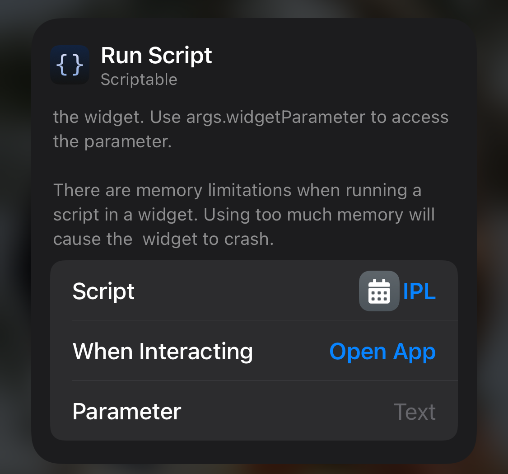
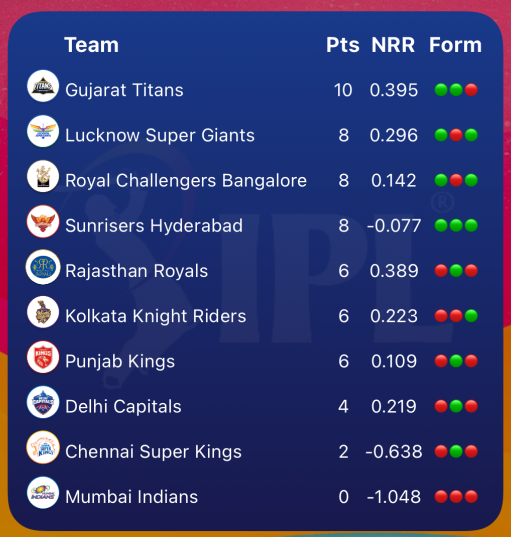
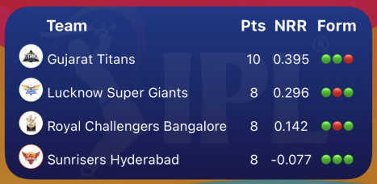
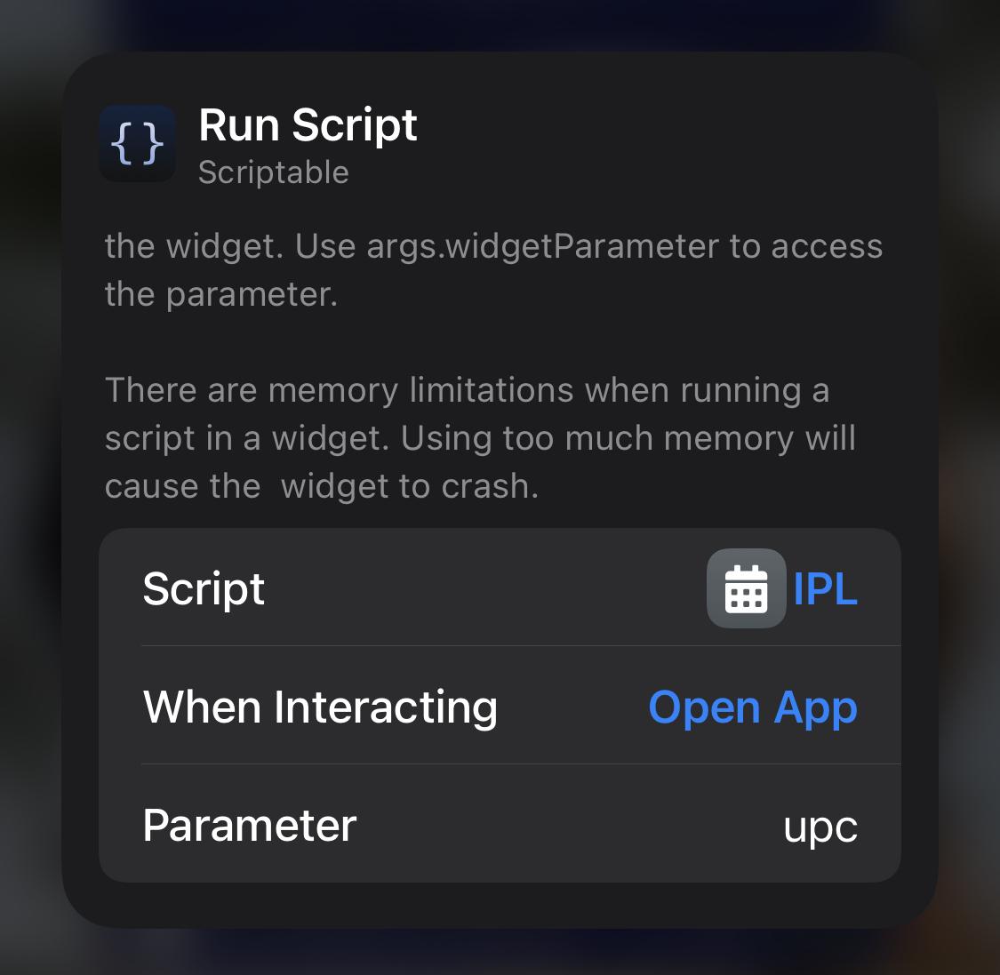
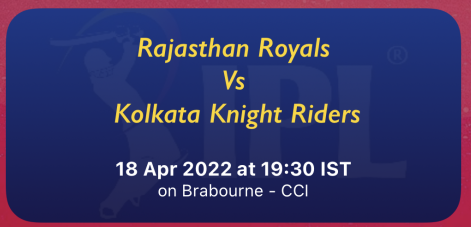
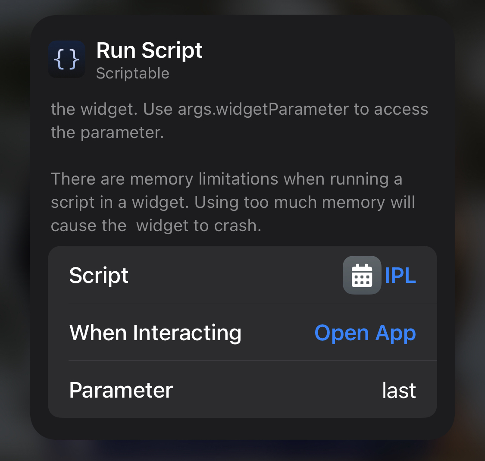
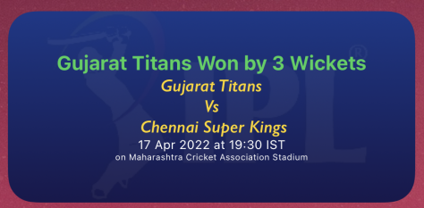
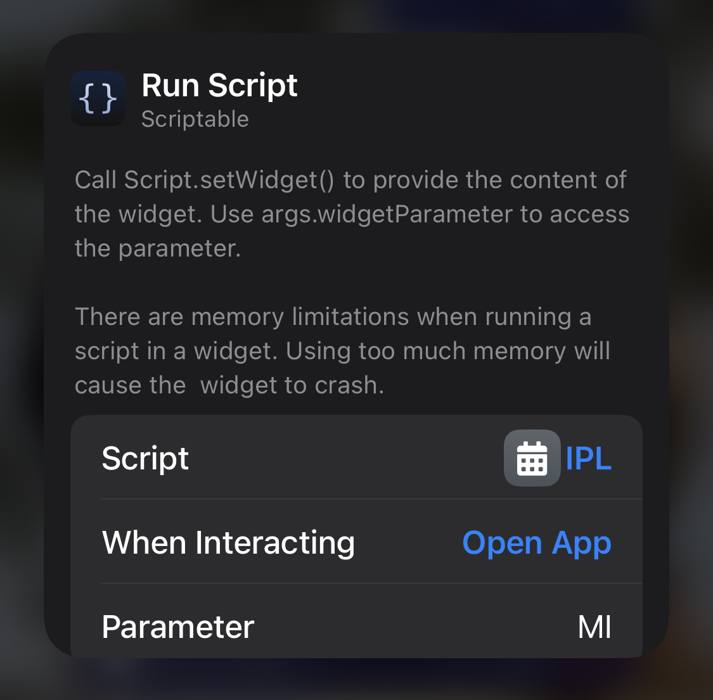
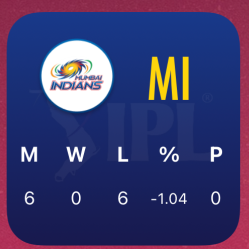
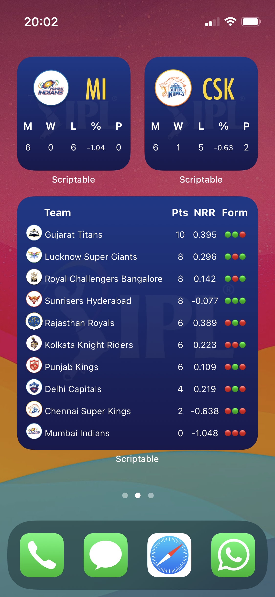

# scriptable-widgets
My personal scriptable widgets for iOS. \
 \
These widgets need scriptable to be installed on your iphone/ipad \
Also it requires internet connection through WiFi or Mobile data

Updated version will be available through this Gist: [IPL.js](https://gist.github.com/abbyjeet/0df876609a7da4feda90190685586d94)

# IPL
IPL (Indian Premier League) held in India for T20 cricket matches.
This widget displays stats for IPL (2022) 
 - points table (all teams - large widget and top 4 teams - medium widget)
 - Upcoming match (medium widget)
 - Result of the last match (medium widget)
 - Favourite team's stats (small widget)

## Instructions
1. Make sure you have added this script [IPL.js](https://raw.githubusercontent.com/abbyjeet/scriptable-widgets/main/IPL.js) to Scriptable first
2. Add a Scriptable widget - small, medium or large (see [next section](#types-of-widgets-and-parameters-required))
3. Hold and press to open the Run Script dialog box \
   
3. Tap on the field for Script and select the script "IPL"
4. Depending on the widget you want, specify the parameter (see [next section](#types-of-widgets-and-parameters-required))
5. Once everything is set, tap outside the dialog box to close it. The widget should refresh in a moment.
  
## Types of widgets and parameters required
### 1. Large Widget
   #### a. Points table for all the teams (No parameter, default)
   
   
   output: \
   
   
### 2. Medium widgets
   #### a. Points table for the top 4 teams (No parameter, default)
   
   
   output: \
   
   
   #### b. Upcoming match details (Parameter: upc)
   
   
   output: \
   
   
   #### c. Last match result (Parameter: last)
   
   
   output: \
      
   
### 3. Small widget
   #### a. Favourite team's stats (Parameter: Team's Code ex. CSK, MI, RCB, etc. see table below for the codes)
   
   
   output: \
      

### Team Codes
| Team Code  | Team Name |
| ------------- | ------------- |
| CSK  | Chennai Super Kings  |
| DC  | Delhi Capitals  |
| GT  | Gujrat Titans  |
| KKR  | Kolkata Knight Riders  |
| LSG  | Lucknow Super Giants  |
| MI  | Mumbai Indians  |
| PBKS  | Punjab Kings  |
| RR  | Rajasthan Royals |
| RCB  | Royal Challengers Banglore |
| SRH  | Sunrisers Hyderabad  |

### More screenshots

   
