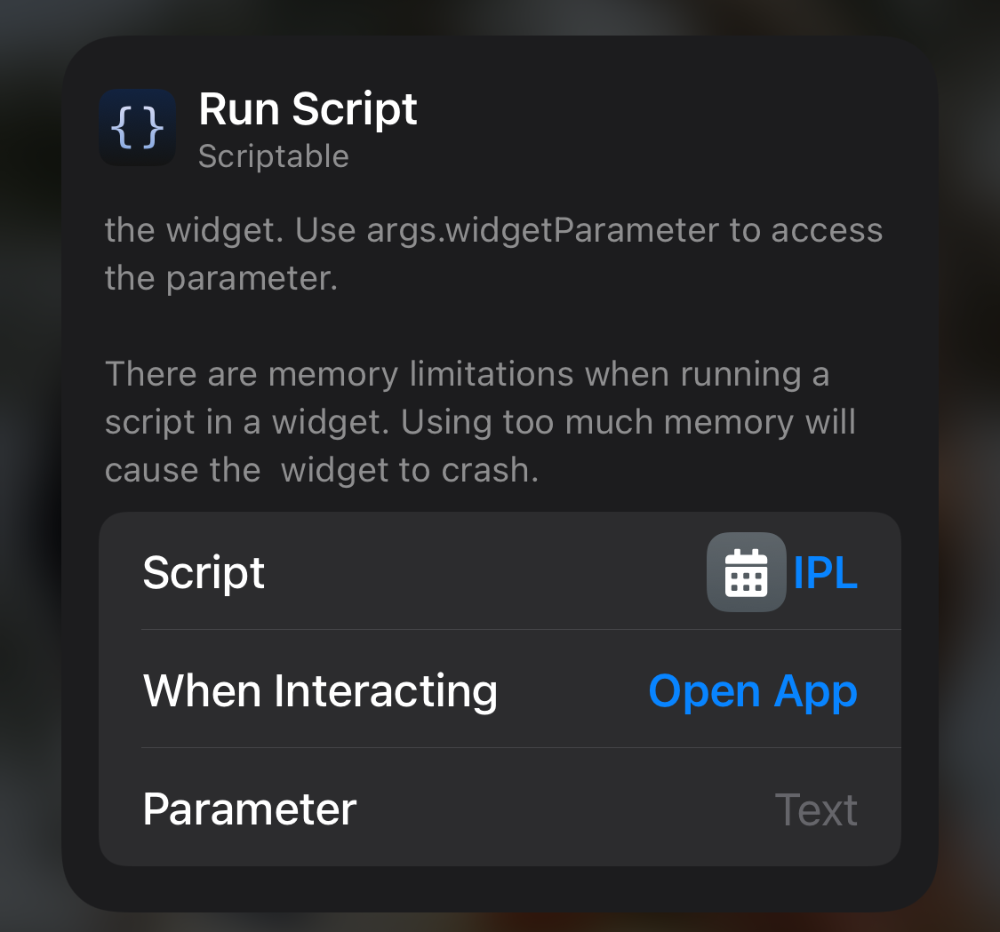

# scriptable-widgets
My personal scriptable widgets for iOS.
These widgets need scriptable to be installed on your iphone/ipad

# ipl.js
IPL (Indian Premier League) held in India for T20 cricket matches.
This widget displays stats for IPL (2022) 
 - points table (all teams - large widget and top 4 teams - medium widget)
 - Upcoming match (medium widget)
 - Result of the last match (medium widget)
 - Favourite team's stats (small widget)

## Instructions
1. Add a widget, then hold and press to open the Run Script menu \
   
3. Points table for all the teams (default, no para

=== To be completed ===
